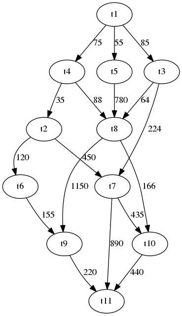

# Aula 26 - Atividade com plataforma MPSoC e RTOS

O exercı́cio proposto consiste em implementar uma aplicação distribuı́da em uma plataforma MPSoC virtual composta por 6 processadores. Procure por pontos de paralelismo na aplicação e reescreva a mesma de forma a distribuir as tarefas no MPSoC. Para isso, use a primitiva hf_cpuid() para identificar processadores individualmente e utilize as primitivas de troca de mensagem do sistema (hf_send() e hf_recv()) para realizar a comunicação entre tarefas.

Aplicação: A aplicação do exercício possui 9 tarefas e é representada pelo grafo de dependências abaixo. Nos nodos são descritos os nomes das tarefas (são todas tarefas de melhor esforço, sem parâmetros de tempo real) e nas arestas são descritos os fluxos de dados (em bytes).

Ferramenta MPSoC: A ferramenta MPSoC (/usr/sim/mpsoc_sim) deve ser configurada para uma malha de 6 processadores antes do uso para a realização dessa atividade. Para isso, configure o ambiente com o comando make noc 3x2 dentro do diretório da ferramenta. Os binários (arquivos .bin) contendo instâncias do kernel e tarefas da aplicação devem ser colocados no sub-diretório /usr/sim/mpsoc_sim/objects. Para simular o hardware por 3 segundos, por exemplo, digite ./mpsoc_sim 3 s. A saı́da de cada processador estará em arquivos out0.txt .. out5.txt contidos no sub-diretório /usr/sim/mpsoc_sim/reports.

Outros detalhes: Para o desenvolvimento da atividade, alguns passos devem ser seguidos:

    Clonar o repositório do RTOS: https://github.com/sjohann81/hellfireos;
    Resolver um problema do compilador cruzado para arquitetura MIPS, criando um link simbólico: sudo ln -s /usr/lib/x86_64-linux-gnu/libmpfr.so.6 /usr/lib/x86_64-linux-gnu/libmpfr.so.4
    Configurar o simulador mpsoc_sim para uma NoC malha de dimensões 3x2;
    Compilar sua aplicação e múltiplas instâncias do kernel gerando 6 arquivos binários, e os colocar no diretório adequado no simulador. Para isso, utilize a plataforma exemplo /platform/noc 3x2, modificando o makefile para apontar para a sua aplicação;
    Testar os exemplos antes de começar a programar, modificando o makefile da plataforma, gerando os arquivos binários para cada processador e copiando os mesmos para o diretório correto no simulador. Simule cada exemplo de 1 a 3 segundos e verifique os arquivos de saı́da (diretório /usr/sim/mpsoc_sim/reports).

Última atualização: segunda, 8 Jun 2020, 16:14